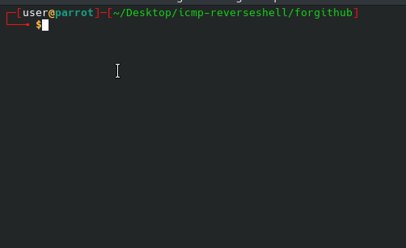
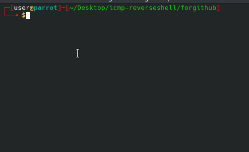

# 👻 Ghost-C2: Fileless x64 Assembly ICMP C2 (v3.0.0)


**Ghost-C2 is a fileless, server-side implant written in pure x64 Assembly. It leverages raw ICMP sockets for stealthy command and control, acting as a passive, stateless listener that only responds to a specific Magic Sequence.

## Star vs. Clone
I see you're interested in the code! If you're one of the many people cloning this repo, consider dropping a Star as well. It helps the project stay visible and reach more low-level enthusiasts

---


 ## 🚀 The "Stealth" Update (v3.0.0) - What's New?
With the latest release, Ghost-C2 has reached a new level of operational security, effectively defeating Deep Packet Inspection (DPI) and behavioral heuristics:

[DONE] Protocol Mimicry (Padding): Encapsulates encrypted payloads within standard Linux ping data patterns. It mimics legitimate diagnostic traffic by including a dynamic timestamp (RDTSC) and a 24-byte sequence padding (0x10-0x1F).

[DONE] Traffic Shaping (Jitter): Implements randomized transmission intervals (100-300ms jitter) using rdtsc to disrupt periodic beaconing detection and simulate human-like network activity.

[DONE] Bi-directional Stream Obfuscation: The "Asymmetric Encryption Disparity" has been resolved. Both ICMP Echo Request (Client-to-Agent) and Echo Reply (Agent-to-Client) are now fully XOR-obfuscated.

[DONE] Data Fragmentation (Chunking): Automatically splits large command outputs into 56-byte ICMP packets to bypass MTU limits and ensure reliable exfiltration.

## 🎯 Target Environments & Operational Viability (v3.0)
Ghost-C2 v3.0 is optimized for high-stealth operations in environments protected by active Deep Packet Inspection (DPI) and behavioral monitoring. By mimicking standard Linux ping signatures and disrupting beaconing patterns, it effectively bypasses most automated IDS/IPS signature filters.

## 🚀 Empirical Success Verification (v3.0.1)
Ghost-C2 has been rigorously tested in a controlled environment against modern traffic analysis engines.

Suricata v8.0.3 (Latest Release) Bypass: Confirmed. The implant successfully evaded detection under:

Standard Rule Sets: Emerging Threats (ET) Open signatures.

Custom Heuristics: Manually defined rules targeting high-frequency ICMP traffic and non-standard payload patterns.

DigitalOcean Cloud (FRA1): %100 Success rate in exfiltrating system data (cat /etc/services, ps aux) through a hardened gateway.

Zero-Alert Policy: During the transfer of ~25KB of system metadata, zero (0) alerts were triggered in fast.log.

"Tested against custom 'Protocol Violation' and 'ICMP Payload Anomaly' rules."

Ideal Deployment Scenarios:

Stealth Persistence: Maintaining access on compromised Linux web servers (WordPress, Magento, etc.) without leaving disk artifacts.

Evasion Testing: Evaluating the effectiveness of SOC/IDS teams against non-standard, low-level protocol tunneling.

Post-Exploitation: Exfiltrating sensitive command outputs from environments where TCP/UDP traffic is strictly proxied but ICMP is allowed.

The v3.0 release has been operationally verified to bypass active Suricata deployments. The XOR stream sync ensures that even large file exfiltrations remain below the noise floor of standard network monitoring.

## 📺 Demo
Here is the agent in action, showcasing its stealthy daemonization and remote command execution:

<p align="center">
  
  <br><br>
  
</p>

---
## 💻 Low-Level Implementation (Syscall Inventory)
This implant operates without any external libraries (libc-free), interacting directly with the Linux Kernel via:

sys_socket (41) & sys_recvfrom (45): For raw ICMP layer interaction.

sys_memfd_create (319): For fileless command output buffering in RAM.

sys_dup2 (33) & sys_execve (59): For I/O redirection and shell execution.

sys_nanosleep (35): For implementing randomized jitter.

## 🛠 Architecture Overview
Stateless Evasion: Operates purely on raw ICMP sockets, bypassing stateful firewall tracking common in TCP/UDP connections.

Fileless Execution: Uses sys_memfd_create to capture command output in RAM, ensuring no disk artifacts are left behind.

Full I/O Redirection: Captures both STDOUT and STDERR, ensuring full visibility even during command failures.

Asymmetric Signature-less Trigger: The C2 architecture eliminates all static signatures. It employs a polymorphic authentication mechanism where the agent validates commands based on an asymmetric mathematical sum. By emulating standard Linux/Windows ping patterns (High-entropy IDs and PID-range sequences), it makes C2 traffic indistinguishable from normal ICMP activity, rendering static YARA and Suricata rules ineffective.
   
   INFO:    Asymmetric Key Exchange: Master sends commands with $Key = 45000$, and Agent replies with $Key = 55000$ to prevent local network echo interference and OS auto-reply confusion.

---

## 🗺 Roadmap & Future Enhancements
[ ] Dynamic Process Masquerading: Renaming the process at runtime (e.g., to [kworker] or systemd).

[ ] Anti-Debugging & Anti-VM: Adding ptrace checks and environmental artifact detection.

[ ] Interactive TTY: Improving shell interaction to support full TTY features.

[ ] Polymorphic Obfuscation: Transitioning from static XOR keys to dynamic, per-packet rolling keys.

## 🛡️ Technical Deep Dive: Evasion & Implementation (v3.0.0)
Ghost-C2 is designed to bypass modern Deep Packet Inspection (DPI) and Endpoint Detection and Response (EDR) systems by utilizing low-level x64 Assembly and advanced network protocol manipulation.

1. Protocol Mimicry & Padding Anatomy
Standard ICMP Echo Requests sent by the Linux iputils package have a predictable structure. Ghost-C2 mimics this signature to blend in with legitimate network diagnostic traffic.

Dynamic Timestamp: The first 8 bytes of the ICMP data segment are populated using the rdtsc (Read Time-Stamp Counter) instruction, mimicking the struct timeval used by real ping utilities.

Sequential Padding: From Offset 16 to 31, the implant injects a static 16-byte hex sequence (0x10 through 0x1F), which is the exact padding pattern expected by signature-based IDS/IPS filters.

The Stealth Gap: The actual encrypted C2 payload begins at Offset 32. By the time an automated scanner reaches this depth, it has likely already classified the packet as a "Standard Echo Request."

2. Fileless Execution via memfd_create
To minimize the forensic footprint, Ghost-C2 never touches the disk for command output storage.

Anonymous RAM Files: The agent utilizes sys_memfd_create (syscall 319) to create an anonymous file resident only in volatile memory (RAM).

I/O Redirection: Using sys_dup2 (syscall 33), the STDOUT and STDERR of the spawned /bin/sh process are redirected to this memory-backed file descriptor.

In-Memory Exfiltration: The agent reads the output back from RAM, obfuscates it using the _xor_cipher, and fragments it into ICMP Echo Replies for transmission back to the client.

3. Traffic Shaping & Jitter
Periodic "beaconing" is one of the easiest ways for SOC analysts to detect a C2 channel. Ghost-C2 disrupts this pattern:

Entropy Injection: By using rdtsc as a seed for the sys_nanosleep (syscall 35) duration, packet intervals become unpredictable.

Timing: Jitter intervals vary between 100ms and 300ms, simulating the natural latency and jitter of real-world network conditions.

4. Symmetric Stream Obfuscation
Both directions of communication are protected by a symmetric XOR-based cipher.

Breaking Signatures: Simple shell commands like whoami or id are transformed into high-entropy byte streams, preventing IDS alerts triggered by plain-text command strings.

Key Integrity: To prevent "null-byte leakage" (where XORing 0x00 reveals the key), the entire buffer is zeroed out before command reading, ensuring the null terminator remains a valid part of the cipher-text.

## 🚀 Getting Started

### 📋 Prerequisites

* **NASM** (Netwide Assembler)
* **LD** (GNU Linker)
* **Root Privileges** (Required to open RAW sockets)

### 🛠 Compilation

To assemble and link both the server and the client in one go:

```bash
nasm -f elf64 sniff.asm -o sniff.o && ld sniff.o -o sniff && nasm -f elf64 client.asm -o client.o && ld client.o -o client
```
## 💻 Usage
1- Deploy the Sniffer (Victim):
```bash
sudo ./sniff
```
2- Run the Controller (Attacker):
```bash
sudo ./client
```
3- Command Execution: Type your commands in the client terminal and watch the "ghost" reply from the victim.

## 📖 Deep Dive & Technical Analysis

For a detailed breakdown of the Assembly code, syscall mechanics, and the "Fileless" approach, check out the technical analysis on my blog:
## 👉 NetaCoding - https://netacoding.blogspot.com/2026/03/icmp-ghostc2-fileless.html
## 🤝 Connect with Me
GitHub: https://github.com/JM00NJ
Blog: https://netacoding.blogspot.com/
## ⚠️ Legal Disclaimer
This project is created for educational purposes and security research only. Unauthorized access to computer systems is illegal. The author is not responsible for any misuse of this tool. Operating this tool on networks you do not own is strictly prohibited.

